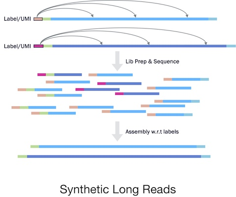
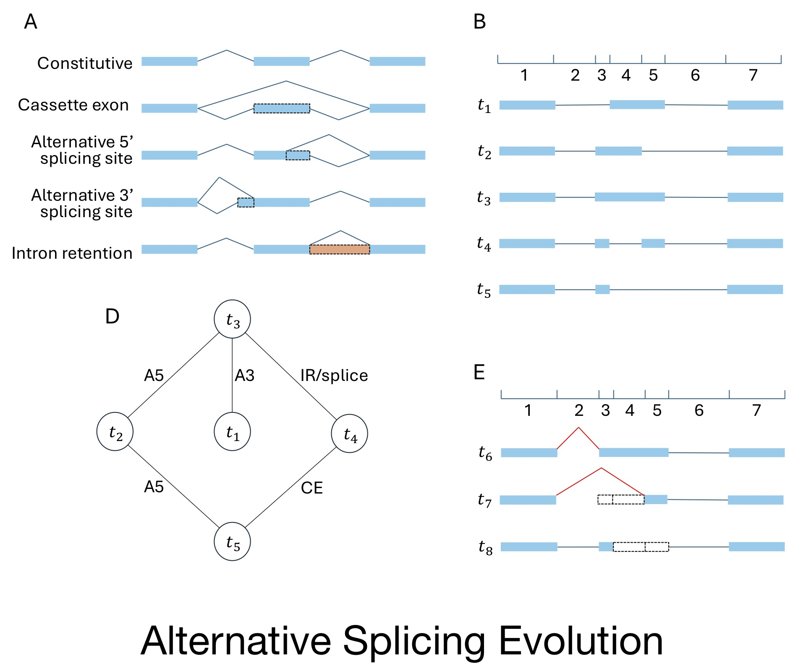
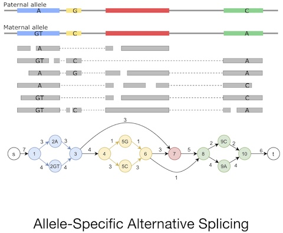

Hi! I'm Carl, a PhD candidate in Bioinformatics at the Pennsylvania State University, advised by [Prof. Mingfu Shao](https://sites.psu.edu/mxs2589). I expect to graduate in May 2025 and am actively **looking for a position in computational biology and/or computer science** area. Before my PhD study, I obtained my BS in Cell & Molecular Biology with First Class Honours from the Chinese University of Hong Kong.

My research focuses on advancing transcriptome analysis through the development of computational methods that address challenges in RNA sequencing and assembly. My work integrates algorithms, machine learning, and biological observations to investigate problems such as alternative splicing, allele-specific expression, and transcript assembly using various sequencing technologies. My publications can be found [here](https://x-zang.github.io/publications/).

Contact: [xbz5174@psu.edu](mailto:xbz5174@psu.edu)

  

## News

[Oct 2024] I presented my work "Augmenting Transcriptome Annotations through the Lens of Splicing Evolution" in Bioinformatics Method Developers Community Day at Penn State. Update Nov '24: This work "[TENNIS](https://doi.org/10.1101/2024.11.04.621892)" is available as a preprint.

[Sep 2024] I traveled to and presented my proceeding talk *Anchorage* at **WABI** 2024 in Royal Holloway, University of London, UK. The proceeding paper is published and freely available at [doi:10.4230/LIPIcs.WABI.2024.22](https://doi.org/10.4230/LIPIcs.WABI.2024.22).

[Aug 2024] I was awarded the Graduate Travel Award from the Huck Institutes of the Life Sciences to support my travel to WABI in UK. Thanks to the generous support from Huck Institutes. 

[Jul 2024] I traveled to and presented a poster "Anchorage Accurately Assembles Anchor-flanked Synthetic Long Reads" at **ISMB** 2024 in Montreal, QC. 

[Jul 2024] My co-authored work "*TERRACE*", previously accepted to RECOMB 2024, has now been accepted to [Genome Research](https://doi.org/10.1101/gr.279106.124).

[Jun 2024] My first-author work, on an assembler for anchor-enabled synthetic long reads data (“*Anchorage*”), has been accepted to **WABI** 2024.
